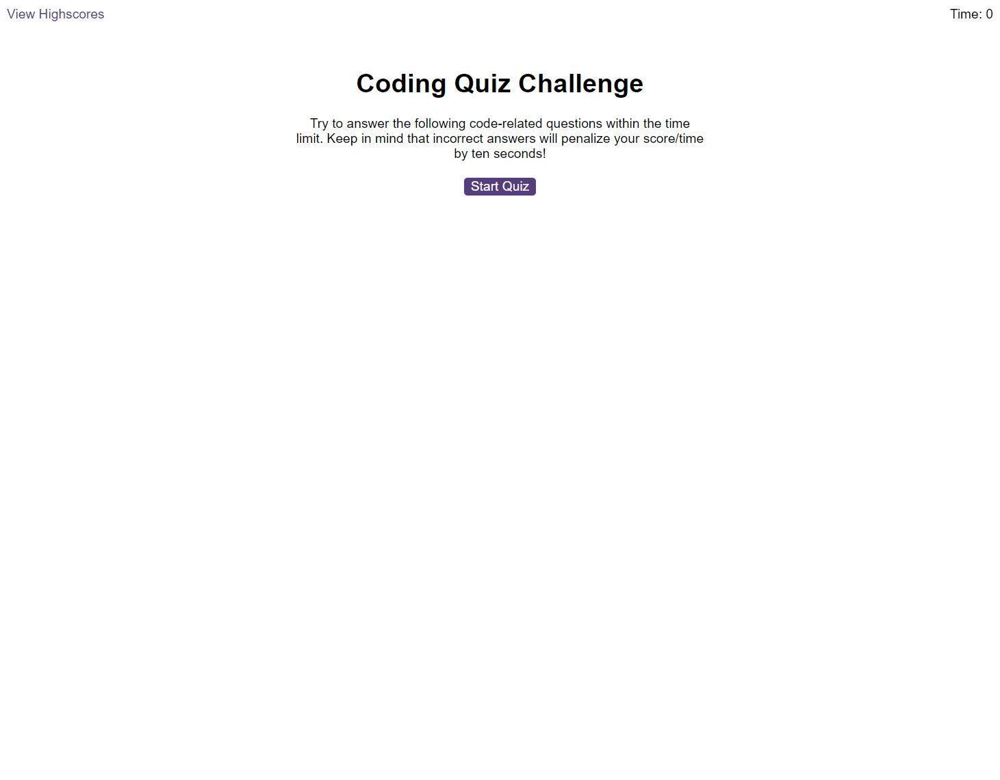

# Speed Quiz Challenge

## Description

This project is a dynamic, interactive speed quiz implemented in JavaScript. The quiz presents users with a series of questions and a countdown timer. For each incorrect answer, time is deducted from the timer, adding a layer of challenge and urgency to the quiz.
At the end of the quiz, users can enter their initials or name to record their score on a leaderboard. This allows users to compete against each other and strive to improve their scores.

One of the unique features of this quiz is the use of sound effects. When users select an answer, a sound effect is played to indicate whether the answer was correct or incorrect. This was my first time incorporating sound into a JavaScript application, providing an engaging, multi-sensory user experience.

The project was a challenging and rewarding opportunity to apply and deepen my understanding of JavaScript, particularly events, timers, and local storage.

## Installation

N/A

## Usage
    1. Open html file in your browser.
    2. Click `start Quiz` and make sure you finish before time is up!.

Link to the website: https://michaltrostowiecki.github.io/speed-quiz-challenge/

## Credits 

N/A

## Licence

This project is licensed under the MIT License - see the [LICENSE](LICENSE) file for details.